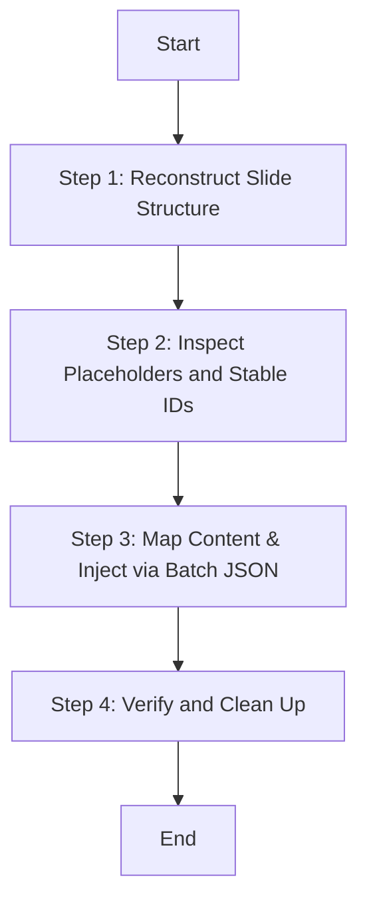

# Populating Office Templates

## Overview
A visual-preserving workflow to clone, reconstruct, and inject text elements into pre-designed Office templates. This technique targets unique OpenXML shape IDs rather than fragile literal strings, ensuring fonts, colors, and visual layouts remain 100% correct.

## Dependencies
This skill requires the following toolchain to be available:
1. **`officecli`** (Must be installed and present in the system PATH).
2. **Python 3.x** (Only uses Python built-in standard libraries; no external `pip` dependencies are required).

## When to Use
- When migrating content from a source document (e.g. Markdown Business Plan) into a pre-designed PowerPoint (.pptx) or Word (.docx) template.
- When slide structures need to be reordered or cloned before text filling.
- When literal find-and-replace fails due to style splits or newlines `\n` in template text.

## Core Process: Reconstruct-Inspect-Inject (RII)



### Step 1: Reconstruct Slide Structure (Atomic Batch)
Never add or remove slides sequentially in separate CLI commands inside loops. Doing so shifts index numbers dynamically and leads to collision or lock errors.
Always copy the template first, compile all clone (`add --from`) and `remove` commands into a single JSON batch array, and execute them in one atomic process.

### Step 2: Inspect Placeholders and Stable IDs
Run the extraction script to map the slide textboxes.
`python scripts/extract_placeholders.py Templates/my_template.pptx Tmp/placeholders.json`
This generates a schema mapping absolute paths (e.g., `/slide[1]/shape[@id=100002]`) to their current placeholder values.

### Step 3: Map Content and Inject
Map your business text into the placeholders. Create an injection JSON file (saved inside `Tmp/`) containing a list of `set` commands:
```json
[
  {
    "command": "set",
    "path": "/slide[1]/shape[@id=100002]",
    "props": {"text": "生息守护"}
  }
]
```
Apply the changes in a single transaction to the file in `Result/`:
`python scripts/batch_injector.py Result/my_output.pptx Tmp/mapping.json`
*(Or run `officecli batch Result/my_output.pptx --input Tmp/updates.json --stop-on-error`)*

## Common Mistakes & Red Flags
- ❌ **Matching text by search (find=...) when unique IDs are available.** Newline characters and runtime spans split the string in OOXML, causing match failures.
- ❌ **Modifying a presentation while it is open in WPS or Microsoft Office.** Lock conflicts will corrupt the output.
- ❌ **Inserting raw SVG shapes.** This breaks PowerPoint's native shape formatting and compatibility.
